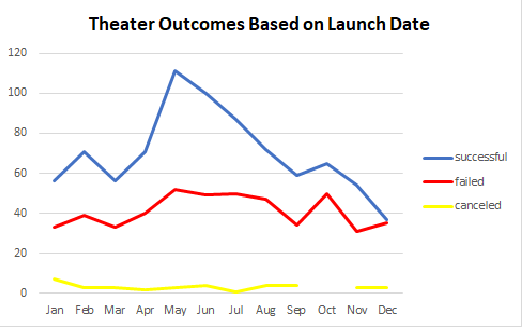
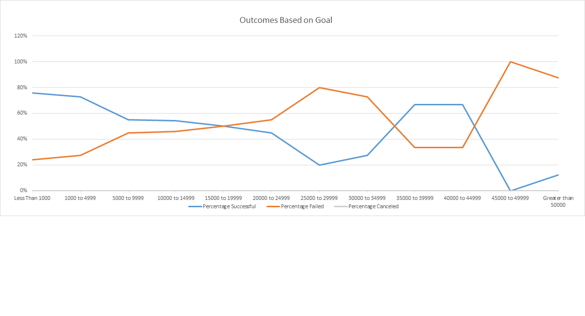

# Kickstarting with Excel
## Overview
### Purpose
The purpose of this document is to assist Louise, an artistic fundraiser, in maximizing her fundraising goals. There is one play called _Fever_ which came close to its fundraising goal in a short amount of time. Now, I will perform an analysis on Kickstarter data to uncover how different campaigns fared in relation to their launch dates and fundraising goals. I will identify trends and guidance on what successful practices that she should employ in the future. 

I will attempt to assist Louise by using the Kickstarter dataset. The Kickstarter dataset consisted of:
- Plays (although it had other art forms as well)
- Financial goals, amounts pledged, and whether the goals were met or not
- Countries
- Dates
- Number of backers
- Average donated

## Analysis and Challenges
### Analysis of Outcomes Based on Launch Date
For this, I did a pivot chart xxx

### Analysis of Outcomes Based on Goals
For this, I did a summary xxxx

### Challenges and Difficulties Encountered
I had challenges with getting the pictures to show, at first. Also they had too much which space on the bottom and I had to crop.

## Results
What are two conclusions you can draw about the Outcomes based on Launch Date?
The months in which she should do fundraising should be the following: 

Louise should only do fundraising in May and October.
Description of the picture and pivot

What can you conclude about the Outcomes based on Goals?
The categories which seem to be doing well are: 

Description of the picture and pivot
Louise will be more successful if she asks for small amounts of money from lots of people.
More successful if:
- Less than 1000
- 30,000-40,000
- 50,000 and up
COuntifs - number of cells in a range that meet a criteria

What are some limitations of this dataset?
It does not tell the entire story. For example, it did not break down the givers - were they individuals, organizations or corporations? If individuals, what were the demographics? If organizations, what type were they? Also, what type of fundraising campaigns were used - was it email, print, TV, social media, or something else?

What are some other possible tables and/or graphs that we could create?
She could add additional graphs based on different countries or different art forms.

