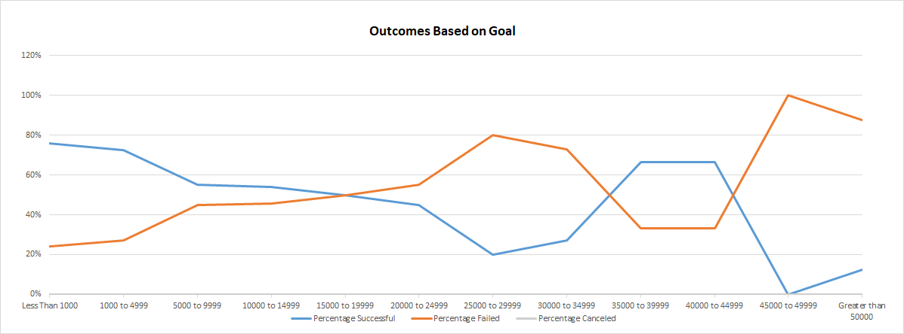

# Kickstarting with Excel
## Overview of Project

### Purpose
The purpose of this document is to perform an analysis on Kickstarter data to help Louise figure out when to do fundraising, and how to go about doing it. This will greatly assist her in knowing how to proceed and get her projects funded. It will uncover trends, and provide guidance to Louise on what events she may want to pursue or discontinue.

The categories which seem to be doing well are: 
-Film and video---
-Music ---
-Theater

The months in which she should do fundraising should be the following: 
-May is the first
-November is second

## Analysis and Challenges

### Analysis of Outcomes Based on Launch Date

### Analysis of Outcomes Based on Goals

### Challenges and Difficulties Encountered

## Results
-You should have campaigns in the month of May. ---
-You should go for theater in the US.

- What are two conclusions you can draw about the Outcomes based on Launch Date?

- What can you conclude about the Outcomes based on Goals?

- What are some limitations of this dataset?

- What are some other possible tables and/or graphs that we could create?

---
